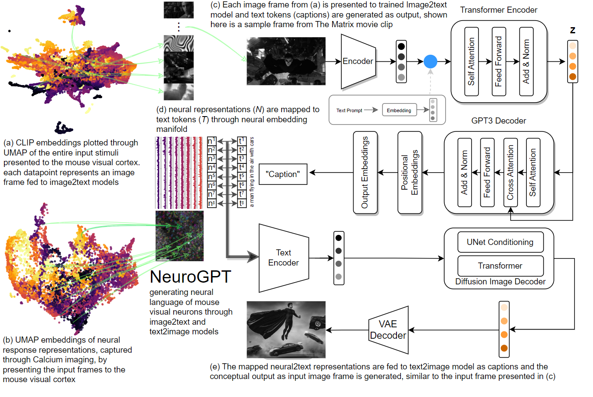
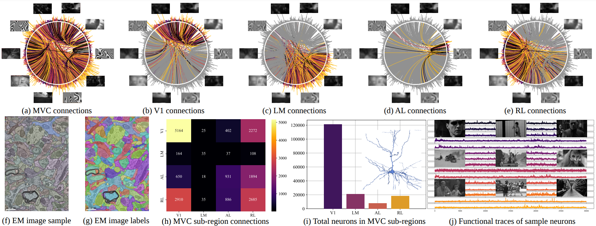
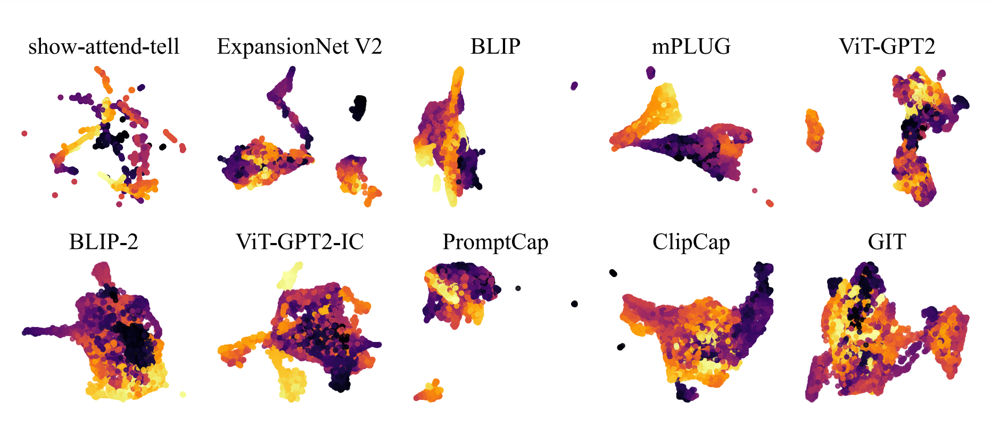
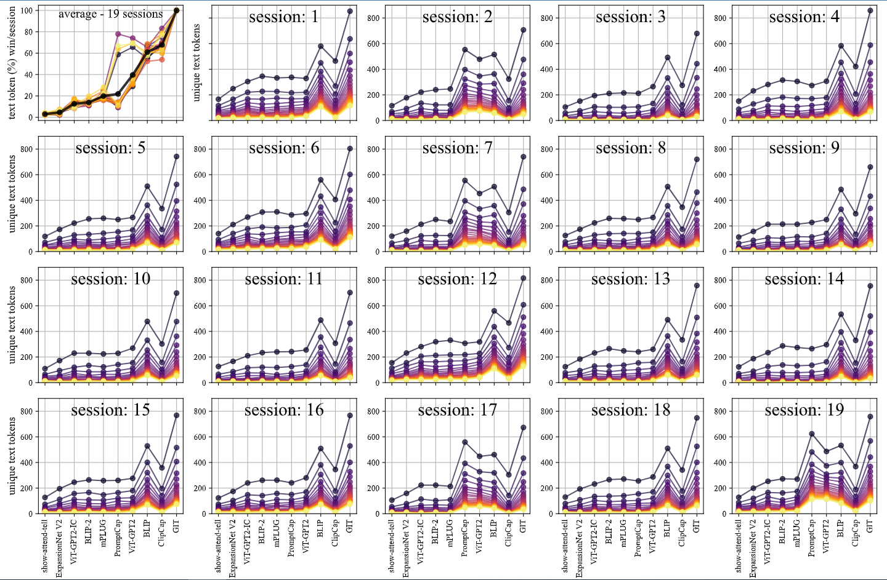
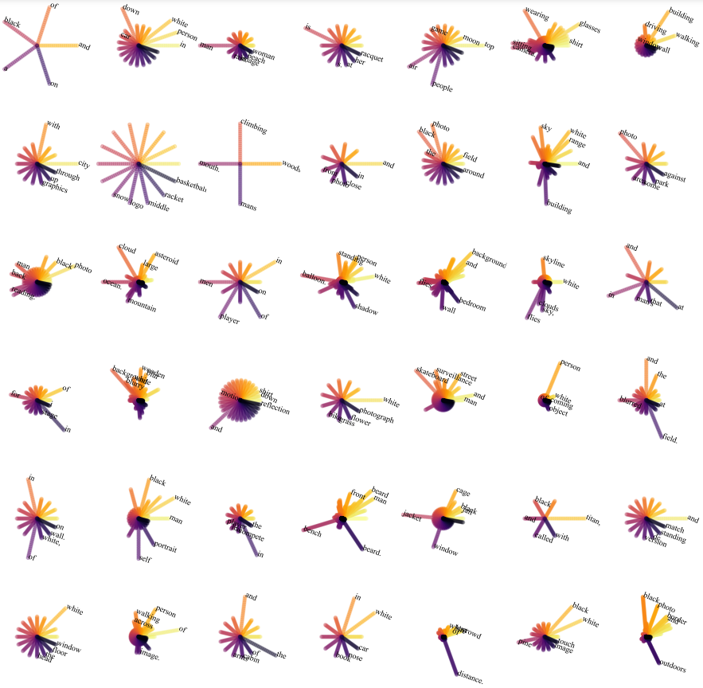

<h2 style="text-align: center;">Abstract</h2>

Understanding the neural transformation of visual perception is a fundamental challenge in neuroscience, and one that has the potential to revolutionize AI model design. In this study, we present a novel embedding manifold to map the neural representations for natural image stimuli in the mouse visual cortex to the text embeddings, using state-of-the-art multimodal language models. Specifically, we processed anatomical and functional neural responses from various sub-regions of the mouse visual cortex and presented the same natural image stimuli to a range of image-to-text models and learned a mapping from the corresponding text embeddings to neural representations. Our results show a strong relationship between text and neural embeddings in the latent space, resulting in a text representation of neural language. To further test the decoding capacity of our neural language, we feed the encoded text-to-neural representations to a variety of state-of-the-art text-to-image models, such as Stable Diffusion, and observe a powerful regeneration of visual representations, capturing the key visual features presented as input stimuli to the mouse visual cortex. The performance of the reconstruction from the text-to-image models is proportional to the neural language encoding capacity of image-to-text models and shows a similar map of neural activations in the mouse visual cortex. This study is the first of its kind to introduce a language of mouse visual cortex neurons encoded through generative AI models, and has significant implications for both AI and neuroscience. By mapping neural representations for a given image to a text embedding space, we gain insights into the underlying structure of visual information processing in mouse as well as its functional similarity with the multimodal language models. We believe this approach has several potential applications in understanding the information processing in the mouse brain and building the next generation of AI models.

<h2 style="text-align: center;">Video</h2>

[Demo video coming soon]

<h2 style="text-align: center;">Method and Results</h2>

<h3 style="text-align: center">Overview of the Microns Dataset</h3>

The complete data profile is shown with overall connectivity of neurons in (a) as well as MVC shortlisted sub-regions (b-e). The spikes on the chord plot shows the highest active neurons for 10 sample stimuli. The anatomical EM data sample is shown in (f) with the corresponding segmentations of the neuron and connections’ in (g). The sub-region based connectivity is plotted in (h) and the total number of neurons captured in the data are plotted in (i). Sample neural representations (response profile) of 15 neurons against natural movie input stimuli is plotted in (j)

 
 

<h3 style="text-align: center">UMAP clusters representing performance of ImageToText models</h3>

UMAP embedding visualization of word2vec generated embeddings of text tokens generated
from each image2text model for the entire Natural Movie Clips dataset

 
 

<h3 style="text-align: center">Performance of ImageToText models at encoding neural responses</h3>

Percentage of winning of each image2text model across all text tokens towards text2neural
mapping/session. A threshold sweep (1-22 minimum unique text tokens) is applied to observe the
winning frequency of the models for the text tokens’ thresholding criteria from lower (1 - black) to
higher and stringent (22 - yellow)

 
 

<h3 style="text-align: center">Distribution of word tokens for randomly sampled neurons</h3>

Text2neural mapping: encoding frequency of unique text tokens on random neurons (e.g.
bottom right neuron encode "black", "photo", "border", "and" and "outdoors" as top 5 tokens)

<!--  -->