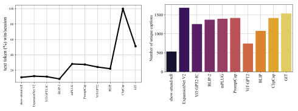

<h2 style="text-align: center;">Abstract</h2>

Understanding the relationship between the visual sensory experience and neuronal ensembles in the brain has been the avant-garde of neuroscience, a challenge that has the potential to revolutionize Human-Computer-Interaction (HCI). A prime utility of this idea is a language-guided visual response alignment, which allows us to relay the visual features through the medium of text, resulting in a personalised HCI system for visually-impaired subjects. With the recent advancements in Generative Multimodal Networks, the utilization of image captioning models can play a vital role in realising this system. However, to test its performance, a neural encoding benchmark is required to compare the performance of image captioning models in generating meaningful yet biologically-grounded captions for the presented visual stimuli. In this study, we present a novel benchmarking technique <i>NeuroGPT</i> to systematically evaluate the biological alignment of image captioning models in pairing their feature representations with their biological counterparts i.e. visual neurons. As a test case for HCI, we demonstrate the performance of <i>NeuroGPT</i> by analysing the data on primates and rodents where thousands of images are presented and neural responses are recorded. We discover GIT and ClipCap as benchmarking image captioning models with the strongest alignment to the biological visual neurons and the highest sensitivity in encoding visual features in their latent space. These models are also observed to provide a high performance on real-world image captioning tasks. Our work broadly contributes towards the design of neuro-inspired generative multimodal networks with unlimited applications for vision applications in HCI and healthcare through natural language-guided visual therapy.

<h2 style="text-align: center;">Video</h2>
<video width="100%">
  <source src="assets/videos/final.mp4" type="video/mp4">
</video>

<h2 style="text-align: center;">Method and Results</h2>

<h3 style="text-align: center">NeuroGPT Pipeline</h3>

Block diagram framework of NeuroGPT: <strong>A</strong> shows that input frames are passed to the image captioning model and are presented to the animal subject. The corresponding neural responses from the visual cortex of the animal subject are mapped to the text tokens (captions) as shown in <strong>B</strong>. To map the visual neurons with the text tokens representing visual features, <strong>C</strong> shows a section of the dataframe for a particular image2text model, which contains the mapping frequency between neuron IDs and text tokens. The neuron with the highest mapping frequency is assigned to that token. <strong>D</strong> represents the text2image module, where the caption generated in section B is fed to a text2image model which generates an image based on the caption.

 
 

<h3 style="text-align: center">Image2Text models' performance on the MICrONS mouse visual cortex dataset</h3>

<strong>A</strong>. UMAP representations of ten image captioning models over the entire unique captions generated by the visual stimuli are shown. <strong>B</strong>. The alignment of biologically active neurons over presenting the similar visual stimuli from mouse dataset is shown, drawn from all the sessions (video clips). <strong>C</strong>. The benchmarking performance of each image captioning model with maximum alignment of the text representations to the biologically active neurons is shown. <strong>D</strong>. The quantitaive performance of image captioning models in systematically mapping the input images to unique captions is presented. <strong>E</strong>. Sample biological neurons with their mapping on unique text tokens is visualized (colors correspond to different text tokens and length corresponds to their mapping alignment. <strong>F</strong>. Top: Activation maps on different images for specific text captions with the highlighted token. Bottom: Image reconstruction by presenting the input text caption to a sample text2image reconstruction model.

 
 

<h3 style="text-align: center">Similar analysis on the primate dataset</h3>

<strong>A</strong>. The benchmarking performance of each image captioning model with maximum alignment of the text representations to the biologically active neurons in primate brain is shown. <strong>B</strong>. The quantitative performance of image captioning models in systematically mapping the input images to unique captions is presented for the primate visual cortex.

 
 

<!--  -->
